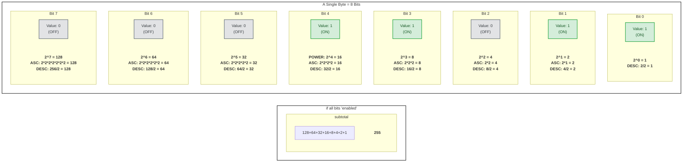

In the below Go file we use bitwise operators to manipulate individual flags (on/off switches) in a single integer, where each bit position represents a different status.

First we'll look at the code, and then we'll explain how it works:

```go
package main

import (
    "fmt"
    "strings"
)

// Define bit flags as constants, where each status is represented by a unique bit position
const (
    StatusActive   = 1 << iota // 1 << 0 which is 0001 (binary)
    StatusAdmin                // 1 << 1 which is 0010
    StatusBanned               // 1 << 2 which is 0100
    StatusVerified             // 1 << 3 which is 1000
)

// Stringify statuses for easier output
func stringifyStatus(status int) string {
    statuses := []string{}

    if status&StatusActive != 0 {
        statuses = append(statuses, "Active")
    }
    if status&StatusAdmin != 0 {
        statuses = append(statuses, "Admin")
    }
    if status&StatusBanned != 0 {
        statuses = append(statuses, "Banned")
    }
    if status&StatusVerified != 0 {
        statuses = append(statuses, "Verified")
    }

    return strings.Join(statuses, ", ")
}

func main() {
    // Let's create a user status and use bitwise OR to combine different flags

    var userStatus int

    // Set the user as active and verified
    userStatus |= StatusActive | StatusVerified
    fmt.Println("Initial Status:", stringifyStatus(userStatus))

    // Add "Admin" status
    userStatus |= StatusAdmin
    fmt.Println("After adding Admin:", stringifyStatus(userStatus))

    // Remove "Verified" status using bitwise AND with NOT
    userStatus &^= StatusVerified
    fmt.Println("After removing Verified:", stringifyStatus(userStatus))

    // Add "Banned" status
    userStatus |= StatusBanned
    fmt.Println("After adding Banned:", stringifyStatus(userStatus))

    // Check if the user is an admin
    if userStatus&StatusAdmin != 0 {
        fmt.Println("User is an admin.")
    } else {
        fmt.Println("User is NOT an admin.")
    }

    // Remove "Admin" status using bitwise AND with NOT
    userStatus &^= StatusAdmin
    fmt.Println("After removing Admin:", stringifyStatus(userStatus))

    // Check if the user is banned
    if userStatus&StatusBanned != 0 {
        fmt.Println("User is banned.")
    } else {
        fmt.Println("User is NOT banned.")
    }

    // Check if the user is an admin
    if userStatus&StatusAdmin != 0 {
        fmt.Println("User is an admin.")
    } else {
        fmt.Println("User is NOT an admin.")
    }
}
```

## Visualising Bits

In case you need a reminder of what bit alignment and shifting look like, take a
look at the following image that shows a byte (which consists of `8` bits):



If diagrams aren't your thing, then here's a traditional image representation:


Think of a byte as a small control panel containing a row of eight individual
light switches, and each of those switches is a bit. A bit can only ever be in
one of two states: turned off (represented by a `0`) or turned on (represented
by a `1`). By flipping different combinations of these eight switches on and
off, a single byte can create `256` unique patterns. In computer engineering, we
use these distinct patterns to represent everything from letters and numbers to
specific status flags in a program.

> [!INFO]
> You might wonder why we say a byte holds `256` values but the maximum is `255`.
> `256` is the _quantity_ of numbers a byte can hold. `255` is the _highest_
> number a byte can hold because `0` takes up the first spot.

## Defining Bit Flags

You can utilize the bitwise `OR` assignment operator (`|=`) to selectively flip
these individual bit switches 'ON' (setting them to `1`). We can then use this "bit
shifting" approach to combine multiple status flags within a single integer.

So for our example, each status was assigned a unique power of 2 using bit
shifting (`1 << iota`). This ensured each flag only affected a single bit:

- `StatusActive` has the binary value `0001` (`1 << 0` == 1 in decimal).
- `StatusAdmin` has the binary value `0010` (`1 << 1` == 2 in decimal).
- `StatusBanned` has the binary value `0100` (`1 << 2` == 4 in decimal).
- `StatusVerified` has the binary value `1000` (`1 << 3` == 8 in decimal).

## Setting Statuses

The following example combines two separate status flags:

```
userStatus |= StatusActive | StatusVerified
```

> [!INFO]
> In Go (and many other languages like C, C++, Java, and Python), `|=` is a
> compound assignment operator. It combines a bitwise `OR` operation (`|`) with
> an assignment operation (`=`).
>
> So it's a shorter way of writing:\
> `userStatus = userStatus | StatusActive | StatusVerified`
>
> Which due to left-to-right evaluation associativity means:
> `userStatus = (userStatus | StatusActive) | StatusVerified`
>
> If you're unsure of what associativity means:\
> In mathematics and logic, bitwise OR is associative. Just like addition
> (`2+3+4` is the same whether you do `(2+3)+4` or `2+(3+4)`), it doesn't matter
> which bits you combine first.
>
> No matter how you group them, you are ultimately just taking all the 1 bits
> from `userStatus`, `StatusActive`, and `StatusVerified` and smashing them
> together into a single value.

In binary, this combination (`0001` + `1000`) results in `1001` (or `9` in
decimal; the earlier diagram/image showed a byte and its first bit is `1` and
its fourth bit is `8`: `1+8` is `9`), which means both the "active" and
"verified" flags are set.

## Adding and Removing Flags

The following example sets the "admin" bit without affecting the other bits, resulting in `1011` (11 in decimal):

```
userStatus |= StatusAdmin
```

## Comparing Statuses

Once `userStatus` has combined flags we can use the `&` operator to perform a bitwise `AND` operation, which means it compares each bit of two integers. For each bit position, if both bits are 1, the result at that position will be 1; otherwise, it will be 0.

So what happens when we compare `userStatus&StatusAdmin != 0`?

Well, `StatusAdmin` is a bit flag defined as `1 << 1`, which results in `0010` in binary. This means that `StatusAdmin` occupies the second bit position in the binary representation of an integer. When we do `userStatus&StatusAdmin`, we're effectively "masking" all bits except for the one represented by StatusAdmin (this is known as **bit masking**).

When we perform `userStatus&StatusAdmin`, we get a result where only the bit corresponding to `StatusAdmin` remains (and is set to `1` if that bit was already set in `userStatus`). If this result is non-zero (`!= 0`), it means the `StatusAdmin` bit is set in `userStatus`. If it's zero, then `StatusAdmin` is not set in `userStatus`.

If we look at the code in `bitwise.go` we'll see `userStatus` is initially set to include `StatusActive` and `StatusVerified`, so `userStatus` is `1001` in binary (which is `9` in decimal). Remember `StatusActive` occupied the first bit position (`0001`), while `StatusVerified` occupied the fourth bit position (`1000`) so if setting both flags we get the combined `1001`.

Next, we add the `StatusAdmin` flag with `userStatus |= StatusAdmin`, making `userStatus` now `1011` in binary (which is 11 in decimal). When we check if `StatusAdmin` is set using `userStatus&StatusAdmin != 0` we get back `2` from `userStatus&StatusAdmin` (which is `0010` in binary) because we've bit masked the other bits that might have been turned on (if you recall, using `&` turns each bit to zero except for those bits that were 1 in both numbers being compared), in order to _reveal_ whether the `StatusAdmin` bit was set on or not (i.e. `0` != `2` so we know this person is an admin).
