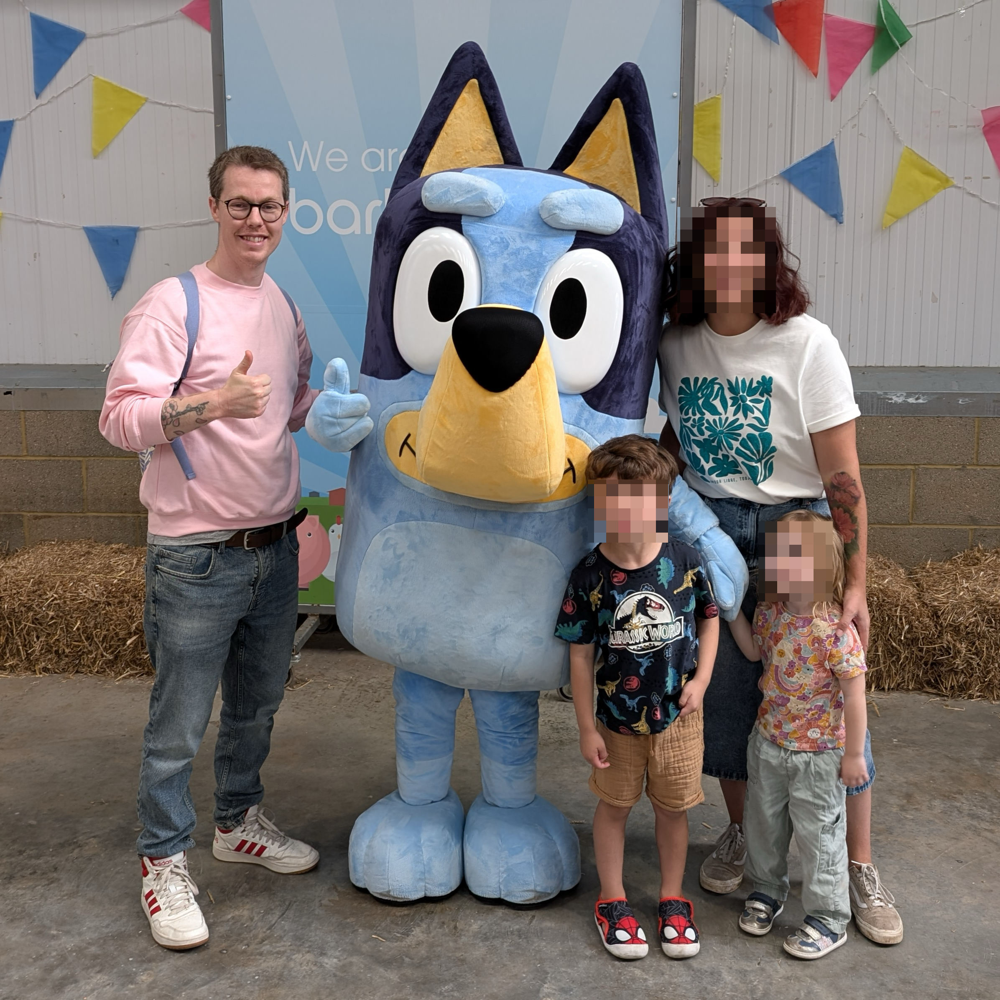

# Resume

## Hello!

Hello, my name is Mark and I work at [Fastly](https://www.fastly.com/) as a Staff Software Engineer.

<small class="image-summary"><b>NOTE:</b> Yes. That is my wife and kids. But I've no idea who the other guy is 😉</small>

### Previously

- Staff Software Engineer at [BuzzFeed](http://www.buzzfeed.com/)
- Principal Engineer at [BBCNews](https://www.bbc.co.uk/news)
- Principal Engineer at [StormCreative](http://www.stormcreative.co.uk/)

## Working Together / Testimonials

The following quotes are all **genuine**. I've never asked anyone I've worked
with to say/write something nice about me, but I've had the good fortune to have
built up wonderful relationships with the people I work with, and so they have
responded in kind by posting nice things to/about me in public work Slack
channels...

	
Product Support at BuzzFeed

	
<i>"As smart as developers are, they are not always good at explaining things in a way that makes human sense. not you. you are an exception. you are A+"</i>

	
<small>-- Product Support at BuzzFeed.</small>

	
I ❤️ this feedback. It came from someone I was mentoring. She was interested in getting a better understanding of how to design and architect software systems, and also how to know what types of questions she should ask when investigating technical incidents.

	
Her feedback also hints at something bigger which I strive for: to help others to do their best work and to push/promote the good work other engineers do (including those from either a diverse background or minority).

	
Engineering Manager at Fastly

	
<i>"Hi Mark, your name keeps coming up (in a good way 😉) and I wanted to put a face to a name. Folks on the team like working with you. You're responsive and provide good and timely feedback."</i>

	
<small>-- Engineering Manager at Fastly.</small>

	
I always aim to build meaningful relationships with the people I work with across an organisation. In doing so I hope to ensure that we are able to work as a cohesive unit, and provide great value to our users. But ultimately I like to be helpful (it makes me feel good), so this was a nice bit of unexpected feedback ❤️

	
Senior Sales Engineer at Fastly

	
<i>"Thanks, I'm amazed that you always deliver top notch answers."</i>

	
<small>-- Senior Sales Engineer at Fastly.</small>

	
Funnily enough I actually _didn't_ have the answer they needed. I wanted to redirect this person to where I thought would be the best place for them to get a solution (so it included as much historical context, and as many signposts, as I could provide).

	
A kind smile, a compassionate ear, and a bit of effort goes a long way in life.

	
Senior Sales Engineer at Fastly

	
<i>"Hey Man… you are a true powerhouse in fixing issues and handling customers… i’m truly impressed by you! Thanks and keep it up!"</i>

	
<small>-- Senior Sales Engineer at Fastly.</small>

	
I work hard to ensure customers get the support they need. This feedback was the result of another example of my work ethic.

	
Senior Solutions Architect at Fastly

	
<i>Hey Mark, thanks again for releasing the 4.0.0 version, last week! The customer already provided positive feedback. It's a pleasure to work in such a smooth way! 🙇</i>

	
<small>-- Senior Solutions Architect at Fastly.</small>

	
In this case my colleague was unfamiliar with writing Go and he was trying to contribute to a couple of different code bases that I was the core maintainer of, and for which I was helping guide him through and supporting/educating him on the various technical aspects of. It was a small change but one I really appreciated him taking the time to dig in and help implement.

	
Customer + CSE (Customer Support Engineer) at Fastly

	
<i>Thank you for your output and all the information you've provided. We really appreciate it. We have applied your latest release on all our production environments and it's looking great and there are no unexpected diffs in our Terraform plans anymore. Again, thank you for your time and your help to understand and resolve this issue as your insights were really helpful.</i>

	
<small>-- Customer</small>

	
<i>Hey Mark, just wanted to say thanks a lot for helping out with the Terraform issue, really appreciated! 🙂</i>

	
<small>-- CSE (Customer Support Engineer) at Fastly</small>

	
We had a strange bug materialize in the Fastly Terraform provider that was causing some issues for customers. I investigated on behalf of CSE as I'm the core SME (Subject Matter Expert) for Terraform and I not only resolved the specific issue but managed to identify a couple of other unnoticed bugs elsewhere in the system which I worked cross-team to help get resolved.

	
It was important to me that this customer (like all our customers) got their issues resolved as quickly as possible, with frequent updates to keep them in the loop and extra detailed explanations so they were better informed. It was a tough set of bugs to identify but I was pleased for the customer when they confirmed their services were all good again.

	
Director of Community at Fastly

	
<i>I want to call out this great thread in the fastly dev forum and give a huge bravo to @integralist for being there, being responsive, and guiding the customer to the solution. Overall the thread is <code>:chefkiss:</code> because...</i>

	
<i>- It makes for a great image optimization use case/support-driven tutorial.</i> 
	<i>- Is a display of how engaged our dev rel team is with the Community.</i> 
	<i>- Is a display of how smart and kind our users are.</i> 
	<i>- Uses the Fastly platform tools (like <a href="https://fiddle.fastly.dev/" target="_blank">https://fiddle.fastly.dev/</a>) to show our work!</i>

	
<small>-- Director of Community at Fastly</small>

	
This was a really nice (and unexpected) compliment. I like to go the extra mile to ensure customers feel seen/heard and that they're supported (even if it means I can't give them an immediate answer and need to refer to another team's expertise first).

	
Developer Relations Engineer at Fastly

	
<i>I just wanted to say that the care and attention you're putting into this work is making me enjoy my work, and I appreciate you.</i>

	
<small>-- Developer Relations Engineer at Fastly</small>

	
I was touched by this feedback as I had been battling a particularly difficult project and this came at a time where I was emotionally and mentally exhausted. Just the pickup I needed 💖

	
Tier 3 Customer Support Engineer at Fastly

	
<i>I want to thank @integralist for always answering any questions I (or others) have with so much detail and attention. Your answers usually long and full of thought and for that I am extremely grateful!</i>

	
<small>-- Tier 3 Customer Support Engineer at Fastly</small>

	
This was posted in a Fastly #gratitude Slack channel and got lots of nice emoji reactions to go with it 💖

	
Senior Customer Support Engineer at Fastly

	
<i>Thank you so much Mark for going above and beyond. I appreciate the details you provided.</i>

	
<code>later the next day...</code>

	
<i>Wow, this is amazing work Mark! Thank you so much for this thorough analysis.</i>

	
<small>-- Senior Customer Support Engineer at Fastly</small>

	
A customer had reported an issue that we initially were not able to replicate. But after some thorough debugging (through _multiple_ internal systems) I was able to identify, explain, and document the source of the problem, then provide a resolution for the customer.

	
Security Architect at Fastly

	
<i>Man, it’s nice working with you</i>

	
<small>-- Security Architect at Fastly</small>

	
This certainly came out of nowhere 🙂. He needed a bunch of information related to some security work I was doing (I was <a href="https://github.com/fastly/cli/pull/1010" target="_blank">implementing SSO Single Sign-On using an OAuth PKCE flow for Fastly's CLI tool</a>) so I gave it to him whilst also pointing out some oddities about the platform that I felt should be addressed.

	
Senior Principal Sales Engineer / TLS Manager / Sr. Principal Engineer, Core Systems at Fastly

	
<i>I wanted to share feedback from <code>NAME_OF_LARGE_CUSTOMER_IM_NOT_ALLOWED_TO_SHARE</code> to give you positive feedback on our Terraform provider vs <code>COMPETITOR</code>'s:</i>

	
<i>"The team were quite shocked at the difference between <code>COMPETITOR</code>'s Terraform approach and Fastly....Fastly was a lot simpler, and just as powerful. Express my gratitude to the team for making the Terraform provider so awesome!"</i>

	
<small>-- Senior Principal Sales Engineer at Fastly</small>

	
<i>It’s all @Integralist 😅</i>

	
<small>-- TLS Manager at Fastly</small>

	
<i>THIS 🔼</i>

	
<small>-- Sr. Principal Engineer, Core Systems</small>

	
<i>Piling on here with <code>ANOTHER_LARGE_CUSTOMER</code> giving kudos to the TF provider. 🙂</i>

	
<small>-- Cloud Engineering Manager</small>

	
I'm very grateful for this feedback, both from the customer and from my colleagues as I had been working really hard on improving the Terraform provider and up until that point hadn't felt that any one had noticed or cared, and so this helped boost my confidence in what I had been doing. 💛

	
Cloud Engineer at Fastly

	
<i>This level of investigation deserves a medal @integralist. Thank you so much for your time and deduction!</i>

	
<small>-- Cloud Engineer at Fastly.</small>

	
A question was raised, which wasn't relevant to the channel it was brought up in but I didn't want this person to go away without the appropriate support. So as well as redirecting them to the correct channel and explaining why I was redirecting them, I then proceeded to explain the steps/processes I follow when trying to figure out the thing they were asking about. This led to a long thread of details and links to code and documentation. As much as I could provide as a helpful send off.

	
Staff Product Manager at Fastly

	
<i>Your code review is itself a work of art! Is there a hall of fame for code reviews.</i>

	
<small>-- Staff Product Manager at Fastly.</small>

	
I take a lot of care in my PR reviews 😊.

	
Director of Developer Experience at Fastly

	
<i>Look… that was f***ing impressive. 👏</i> Thank you so much!

	
<small>-- Director of Developer Experience at Fastly.</small>

	
A customer was having issues with one of our tools when using Windows. Fastly pulled out all the stops to get me the access I needed to investigate and debug the issue properly and I was able to get a fix in place in a few hours, helping the customer realise what an asset Fastly is to their workflow.

	
Principal Engineer in Edge Networking at Fastly

	
<i>You demonstrate, year in and year out, an excellent capacity to learn new systems and languages, pick up the responsibility of managing and being responsible for parts of our stack and technology and it looks like you work smoothly and effortlessly with our colleagues both in person / zoom and in slack / Jira / pull requests.  Thank you also for your regular, consistent contributions and easy-going working demeanor.  This is the sort of collegial professionalism and competence that makes Fastly a great place to work.</i>

	
<small>Principal Engineer in Edge Networking at Fastly.</small>

	
This particular person was leaving Fastly (to retire) and I reached out to wish them all the best and to let them know what an honour it had been for me to get just a small bit of experience working with them. This was their response to me, totally unexpected last piece of kindness shared by this wonderful individual.

	
Staff Product Manager in Network Services at Fastly

	
<i>I'm sharing a Very, Very Big Shout-Out to @integralist for his work on the Eng side of the Domainr + Fastly systems integration efforts!</i>

	
<code>DETAILS I CANT SHARE</code>

	
<i>This huge milestone will make operating and maintaining the Domainr service much more straightforward for the Domain Services Eng team going forward.</i>

	
<i>Thank you, Mark!</i>

	
<small>-- Staff Product Manager in Network Services at Fastly.</small>

	
<i>I also want to add that @integralist has done an amazing job on both documentation and tooling improvements for on-call.</i>

	
<i>As a member of the domain services team that is now responsible for handling on call and being onboarded to domainr codebase and systems, it has been a huge help in orienting myself.</i>

	
<i>He has also been super helpful in knowledge sharing with active pairing and helping out with presentations too!</i>

	
<i>We appreciate you Mark!</i>

	
<small>-- Staff Software Engineer in Network Management at Fastly.</small>

	
Always nice to get some recognition from your peers for the hard work you put in and the care you have for the projects you work on.

	
Staff Product Manager (Network Services) / Sr. Principal Engineer / Sr. Engineering Manager at Fastly

	
<i>Mark this is great! Immaculate, even. ⭐⭐⭐⭐⭐, 10/10 no notes. This is the Sistine Chapel of refactorings (seriously)</i>

	
<small>-- Staff Product Manager (Network Services)</small>

	
<i>Yep, this is <code>#eng-wins</code>–worthy and I want to shout it from the rooftops.</i>

	
<small>-- Sr. Principal Engineer</small>

	
<i>Love this!</i>

	
<small>-- Sr. Engineering Manager</small>

	
I created a design document for how to improve the
	structure and tooling around secrets managements, especially related to
	certain applications the Domain Services team are responsible for. After
	much back and forth discussion I went ahead and started to implement a POC
	of my suggested approach, and I recorded a video to demonstrate the features
	and the design, all with the hope to gauge feedback and tweak as necessary, 
	and the response was a lot better than I expected 😍

	
Senior Manager, Technical Documentation | Product Growth at Fastly

	
<i>I wanted to take a moment to recognize Mark's recent help with a GitHub workflow implementation. I've been trying to teach myself some things about more complex GitHub interactions and this was on my list of goals for Q1 2025. Mark took the time to test an approach in his private repository to ensure things would work. What really made the difference was how he helped me understand how to adapt the workflow to my specific needs. His willingness to both gently mentor and troubleshoot, especially while busy and in an entirely different time zone than me made this successful. And he cheered me on to boot. I'm genuinely grateful for his support. This kind of collaborative knowledge-sharing makes our company stronger.</i>

	
<small>Senior Manager, Technical Documentation | Product Growth at Fastly</small>

	
This was given as Workday feedback and it was really nice 
	they took the time to do this. Not much more to say, other than I always
	like to ensure people feel supported.

	
Senior Software Engineer, Domain Services at Fastly

	
<i>The amount of things I've learned from `@integralist` 's blog posts is incredible. Thank you so much! `:salute:`. Your blog is legitimately a gold mine in terms of information. Thank you for taking the time to write all of those posts, I learn something every time I look at them.</i>

	
<small>Senior Software Engineer, Domain Services at Fastly</small>

	
The team had been discussing how to profile Go programs
	and I had written a blog post covering all the details years back that I
	thought would be useful to the team (who were new to Go). I'm always
	genuinely pleased to hear that my blog is useful to people.

	
Staff Engineer (formerly Engineering Manager) Logging Team at Fastly

	
<i>Hey Mark, I am sailing into retirement next week and I wanted to pop in and say goodbye and thanks. I learned a lot from you and your written words. Whenever we got to work together I could always count on you providing feedback with grace and patience. Thanks for making Fastly a better place</i>

	
<small>Staff Engineer (formerly Engineering Manager) Logging Team at Fastly</small>

	
I was genuinely touched that this person reached out
	before they took off for a well deserved retirement. It meant the world
	to me to know that I had made a positive impact on them and their time
	working with me.

## Summary

I ideally want to get across three fundamental aspects about me:

1. I care. I care about the people I work with, the organisation I work for, and our customers.
1. I'm passionate about programming and the openness of the web
1. I love getting the chance to learn and experience new technology

## Connect

You can find me online at the following locations:

- [integralist.co.uk](http://www.integralist.co.uk/)
- [github.com/integralist](https://github.com/integralist)
- [twitter.com/integralist](http://www.twitter.com/integralist)
- [linkedin.com/mark-mcdonnell](https://www.linkedin.com/in/mark-mcdonnell-08800565)

## Brief History

- [Fastly (2020-present)](#fastly-october-2020-present)
- [BuzzFeed (2016-2020)](#buzzfeed-june-2016-october-2020)
- [BBC (2013-2016)](#bbc-jan-2013-june-2016)
- [Storm Creative (2001-2012)](#storm-creative-feb-2001-dec-2012)

### Fastly (October 2020 - present)

 
Details

	
I was a former customer of Fastly, and had become well known for publishing probably the longest known article on the subject of Varnish, VCL and Fastly's implementation.

	
I joined Fastly to work within its new (at the time) Developer Relations team helping to manage, support and be the core developer for their suite of API clients (inc. orchestration tools such as Terraform and Fastly's own <a href="https://github.com/fastly/terraform-provider-fastly" target="_blank">Terraform provider</a>, and the <a href="https://github.com/fastly/cli" target="_blank">Fastly CLI</a>).

	
While working within the Developer Relations team I had the opportunity to work on critical Rust projects such as https://fiddle.fastly.dev and to work cross-team to develop a new authentication model for customer services.

	
In 2023 it became apparent that the tools I was responsible for maintaining were becoming even more important for our customers and so I was able to move from DevRel into my own dedicated team (Customer Developer Tools) to continue to support them without having to also support the various DevRel related projects and services.

	
In 2024, I was brought into a new team (a team of one for about a year) called "Domain Services" to
		help onboard and integrate a new API Fastly had acquired. This required
	a significant amount of time and effort as (up until this point) I had only
	worked on open-source projects at Fastly and this was my first exposure to
		the internal systems and deployment platform and pipelines.

### BuzzFeed (June 2016 - October 2020)

 
Details

	
I joined as a Senior Software Engineer as part of a new 'core' UK dev team. We were responsible for decommissioning a 10yr+ legacy Perl monolithic application stack over to individual Python and Go services.

	
I was working primarily within BuzzFeed's OO-INFRA group, which sits somewhere in-between traditional infrastructure/operation teams and engineering teams building user facing products. Our motivations were to make the lives of our fellow engineers easier by building tools, services and abstractions that enabled them to work more quickly and efficiently.

	
January 2018 BuzzFeed promoted me to Staff Software Engineer, after helping to design/architect, develop and maintain some of BuzzFeed's key infrastructure and software (CDN, caching strategies, routing behaviours, and security/authentication related concerns).

	
January 2019 I moved over to the Core Infrastructure team (which consists of separate sub teams). I was part of the 'Infra Edge' team, and we were responsible for strengthening and securing our edge infrastructure and applications. The 'edge' is the surface area of our infrastructure that is in direct contact with the public internet. It includes DNS and the various services that accept ingress traffic from the Big Bad Internet. It is essential to our business that our Edge be a resilient and security-focused layer of our infrastructure.

	
Each year I participated in different working groups and mentoring programs, and became part of the 'on-call' rota, and handled interactions with the Hackerone program.

	<blockquote>
		
⚠️  <b>NOTE</b> I'm a remote worker and my team resides primarily in New York, so good communication, focus and work ethic was essential.

	</blockquote>

### BBC (Jan 2013 - June 2016)

 
Details

	
I joined <a href="http://www.bbc.co.uk/news" target="_blank">BBC News</a> as a client-side/mobile specialist within their Core News team. Within the year I had moved into a senior engineering role. The (then) Technical Lead for the BBC News Frameworks team requested I join them in order to help the organisation transition from its current platform over to one built upon the AWS platform.

	
I started in the Frameworks team building and designing back-end architecture for different microservices hosted upon the AWS platform, and we developed these services primarily using JRuby. In October 2014, I was offered the role of Technical Lead.

	
Near the end of 2015 I decided to change roles to Principal Software Engineer, as my previous role involved more meetings and handling line manager duties, whereas I wanted to focus my time more on helping my team solve technical problems.

### Storm Creative (Feb 2001 - Dec 2012)

 
Details

	
I started working at the agency <a href="http://www.stormcreative.co.uk/" target="_blank">Storm Creative</a> straight out of college. I was always focused on learning and improving my skill set - both technical and communication skills - the latter helped me communicate better with both clients and other stakeholders/colleagues.

	
I progressed upwards through the organisation, moving from initially being a client-side web developer (this included doing animations utilising ActionScript 3.0) to becoming a server-side developer (ASP.NET, PHP and Ruby), then onto becoming a Technical Lead across all projects and finally becoming the Digital Media Manager responsible for my own team of four engineers and overseeing all aspects of our projects.

> [!WARNING]
> From here on we get deep into details. It's not necessary to read on unless
> you're really interested in what I've been up to 🙂
>
> I should also stress that I try my best to add things I've been doing, but the
> reality is I do a lot of different types of things for my employer that I
> can't share or I forget about 😅 so this isn't meant to be exhaustive
> (although at a glance it might appear like it is).

## Impact!

I'd like to share the projects I've worked on over the years and the impact/value this work has provided.

> [!NOTE]
> My 'impact' has primarily been as a _remote_ worker. My hope is that the following list demonstrates how I've made a positive impact (both as an IC and as a Team Lead) while also being a 100% remote worker with a family to support and balance against.

- [Impact at Fastly](#impact-fastly)
- [Impact at BuzzFeed](#impact-buzzfeed)
- [Impact at BBC](#impact-bbc)

### 🏢 Fastly

### 2025

- **What**: Took on a lead engineering role for "Blue Ribbon", a major project to enable path-based routing for customers via the API.\
  **Why**: My experience in API design and leading complex projects made me a good fit to drive this high-priority initiative forward.\
  **Impact**: I quickly got up to speed on a new and complex domain, authored the core API design document, and began leading the technical implementation. This project will deliver a highly-requested feature, allowing customers to manage complex routing rules without writing custom code.

- **What**: Collaborated with another team to create architectural diagrams for the Managed DNS project.\
  **Why**: To ensure a shared understanding and alignment on a complex, cross-team initiative.\
  **Impact**: The collaborative effort resulted in clear and accurate diagrams that became the source of truth for the project's architecture, improving communication and reducing misunderstandings between teams.

- **What**: Created the official on-call process and documentation for the Domain Services team.\
  **Why**: A clear and well-defined on-call process is essential for ensuring service reliability and maintaining a healthy work-life balance for the team.\
  **Impact**: The document established clear expectations and procedures for the on-call rotation, leading to more effective incident response and a more sustainable on-call experience for engineers.

- **What**: Played a key role in triaging and resolving a major Terraform issue related to a legacy product deprecation.\
  **Why**: The issue was impacting a large number of customers and required deep expertise in both Terraform and Fastly's platform to resolve.\
  **Impact**: My involvement helped to quickly identify the root cause and guide customers towards a solution, minimizing the impact of the deprecation and demonstrating our commitment to customer support.

- **What**: Integrated a new certificate authority into the Ascerta platform.\
  **Why**: To provide more options and redundancy for certificate issuance.\
  **Impact**: This integration increased the flexibility and resilience of our certificate issuance pipeline, giving us more choices and mitigating risks associated with relying on a single authority.

- **What**: Implemented and configured the core messaging infrastructure (NSQ) for the Ascerta service.\
  **Why**: A reliable and scalable messaging queue is the backbone of Ascerta's asynchronous certificate processing pipeline.\
  **Impact**: This work ensured the Ascerta service had a robust and performant foundation, capable of handling a high volume of certificate operations reliably.

- **What**: Was a core member of the team responsible for designing the next-generation Fastly Terraform Provider.\
  **Why**: A complete rewrite was necessary to leverage new frameworks and address long-standing architectural issues.\
  **Impact**: My contributions helped shape a modern and more maintainable provider architecture, which will result in a more reliable and feature-rich experience for customers managing their Fastly services with Terraform.

- **What**: Created detailed architectural diagrams to visualize and explain the upcoming Managed DNS service.\
  **Why**: The system was complex and a visual aid was needed to help stakeholders and team members understand how the different components would interact.\
  **Impact**: The diagrams became a key communication tool, clarifying complex concepts and facilitating productive discussions about the architecture, which helped align the team and accelerate the project.

- **What**: Presented the architecture and implementation of the Ascerta project to the wider team.\
  **Why**: To share knowledge, gather feedback, and ensure alignment on the technical direction of this critical new service.\
  **Impact**: The presentation helped upskill the entire team on the new architecture, fostering collaboration and ensuring a shared understanding of the project's goals and design.

- **What**: Led the engineering effort for "Ascerta", a new TLS certificate issuance and renewal service.\
  **Why**: To create a modern, scalable, and automated platform for managing TLS certificates for our customers and internal services.\
  **Impact**: Ascerta provides a robust and asynchronous pipeline for certificate management, improving the reliability and speed of issuance and renewals. This foundational service is critical for securing customer applications.

- **What**: Began the architectural redesign of a core service to create a dedicated API for managed TLS certificates.\
  **Why**: To decouple certificate management from other service logic, creating a more modular and scalable architecture.\
  **Impact**: This foundational work paved the way for "Ascerta", a new, standalone certificate issuance service, enabling greater flexibility and focus on TLS automation.

- **What**: Designed and implemented a new, automated secrets management workflow between 1Password and HashiCorp Vault.\
  **Why**: To improve security and efficiency by automating the synchronization of secrets.\
  **Impact**: This new system reduced manual toil, eliminated inconsistencies, and strengthened our security posture by ensuring secrets were managed in a consistent and automated way.

- **What**: Onboarded and mentored a new engineer joining the team.\
  **Why**: To ensure new team members feel supported and can become productive contributors as quickly as possible.\
  **Impact**: My mentorship helped the new hire to quickly integrate with the team and start contributing to key projects, strengthening the team's overall capacity.

### 2024

- **What**: Developed a bot to automatically track and report on scheduled maintenance from our partners.\
  **Why**: To provide the on-call team with proactive awareness of external maintenance events that could impact our services.\
  **Impact**: The bot significantly improved the on-call team's situational awareness, allowing them to anticipate and respond to potential issues more effectively, reducing stress and improving service reliability.

- **What**: Rewrote a legacy component responsible for managing partner zone data.\
  **Why**: The original implementation was difficult to maintain and extend.\
  **Impact**: The new implementation was more robust, easier to understand, and simpler to maintain, which reduced technical debt and made it easier to add new partners in the future.

- **What**: Migrated another data synchronization process from GitHub Actions to a more reliable internal scheduling platform.\
  **Why**: To improve the reliability and performance of critical data workflows that were not well-suited for GitHub Actions.\
  **Impact**: The migration resulted in a more stable and efficient process, reducing operational overhead and the risk of data inconsistencies.

- **What**: Initiated the planning for a multi-region redundancy strategy for a critical service.\
  **Why**: To improve the service's resilience and availability in the event of a regional outage.\
  **Impact**: This kicked off a key initiative to improve the disaster recovery capabilities of the service, ultimately making it more reliable for our customers.

- **What**: Designed a system for synchronizing secrets between 1Password and HashiCorp Vault.\
  **Why**: To streamline secrets management, reduce manual effort, and ensure consistency across different systems.\
  **Impact**: The design laid the foundation for a more automated and secure secrets management workflow, improving both developer productivity and our security posture.

- **What**: Re-implemented a critical certificate expiry notification script as a robust Go service.\
  **Why**: The old script was fragile and unreliable. A more robust solution was needed to prevent certificate-related outages.\
  **Impact**: The new service provided reliable and timely notifications about expiring certificates, preventing potential service disruptions and improving the security posture of our systems.

- **What**: Created a series of video tutorials to help onboard and upskill engineers on complex systems.\
  **Why**: To provide a scalable and accessible learning resource for current and future team members.\
  **Impact**: The videos accelerated the learning process for engineers, making it easier for them to understand complex topics and contribute to projects more quickly.

- **What**: Authored a strategic API planning document for integrating the Domainr API into a larger Unified Domain Management platform.\
  **Why**: To provide a clear roadmap for a major architectural integration and ensure alignment across teams.\
  **Impact**: The document provided a clear vision and technical plan that was adopted by the project, ensuring a smooth and successful integration effort.

- **What**: Automated the login process for domain registry operators.\
  **Why**: The manual login process was time-consuming and a potential security risk.\
  **Impact**: The automation improved operational efficiency and security, and laid the groundwork for future automation of password management, further reducing manual toil.

- **What**: Authored a detailed proposal for new monitoring alerts and refined the on-call process for the Domainr team.\
  **Why**: To create a more sustainable and effective on-call rotation with actionable alerts.\
  **Impact**: The proposal led to a significant improvement in our on-call experience, with fewer false positives and clearer runbooks, allowing the on-call engineer to resolve issues more efficiently.

- **What**: Acted as the Subject Matter Expert for Terraform in the design of new APIs for domain management.\
  **Why**: My expertise was crucial to ensure the new APIs would integrate seamlessly with Terraform, a key tool for many of our customers.\
  **Impact**: My guidance helped shape the API design to be friendly to Infrastructure as Code workflows, ensuring a great customer experience for those using Terraform to manage their domains.

- **What**: Designed and implemented a new set of monitoring alarms for the Domainr API.\
  **Why**: To improve observability and ensure we could proactively detect and respond to issues before they impacted customers.\
  **Impact**: The new alarms provided better visibility into the health of the service, leading to faster incident detection and response times, and ultimately a more reliable service for users.

- **What**: Designed and implemented a robust validation process for a critical configuration file using schemas and CUE.\
  **Why**: The configuration file was complex and manual changes were prone to error, which could cause service disruptions.\
  **Impact**: This new validation system prevented invalid configurations from being deployed, significantly improving the reliability and stability of the service. It also made it safer and easier for developers to make changes.

- **What**: Became a subject matter expert in TLS certificate management processes and operations for our internal TLS pipelines and services.\
  **Why**: The team needed deep expertise in this area to ensure the security and reliability of the service.\
  **Impact**: I created comprehensive documentation and tooling that upskilled the entire team, reducing operational risks and improving our ability to manage certificates effectively.

- **What**: Successfully advocated for maintaining the architectural integrity of a newly migrated service.\
  **Why**: There were suggestions to revert parts of the new architecture, which would have reintroduced technical debt and complexity.\
  **Impact**: By providing clear reasoning and vision, I helped the team stay the course, resulting in a more maintainable, scalable, and modern system architecture for the long term.

- **What**: Implemented a system for auditing and backing up critical domain data.\
  **Why**: To ensure data integrity and provide a recovery path in case of data loss or corruption.\
  **Impact**: Increased the resilience and security of the Domainr service by ensuring critical data was regularly backed up and could be verified for correctness.

- **What**: Advocated for and helped establish better communication practices, both internally and with customers.\
  **Why**: Clear, positive, and proactive communication is key to building strong team dynamics and customer relationships.\
  **Impact**: Fostered a more positive and collaborative team environment and improved the quality of customer interactions, leading to better outcomes and higher satisfaction.

- **What**: Migrated a critical data processing workflow from GitHub Actions to a more robust internal component.\
  **Why**: GitHub Actions was not the ideal environment for this stateful, long-running task, leading to reliability issues.\
  **Impact**: The migration resulted in a more reliable and efficient data processing system, ensuring the integrity of important business operations.

- **What**: I wrote a document "Terraform validation for API modifications"
  that proposed a solution for how we can validate API changes against Terraform
  to prevent breaking changes making their way into production.\
  **Why**: There was an incident where a Fastly API introduced a breaking
  change that affected an application I was on-call for. It was a confusing bug
  and took a lot of time to investigate and identify and I was concerned for
  our customers and how they might be affected (especially considering how
  difficult Terraform can be to work with in general).\
  **Impact**: This proposal document kick-started a new initiative to ensure
  Terraform is treated as a first-class citizen within the Fastly ecosystem.

- **What**: Automated the CI/CD promotion workflow from staging to production environments.\
  **Why**: The manual promotion process was slow and prone to human error.\
  **Impact**: Streamlined the release process, making deployments faster, more reliable, and less error-prone. This allowed the team to deliver value to customers more frequently.

- **What**: Collaborated on a project to improve the Fastly CLI's service creation capabilities.\
  **Why**: The existing functionality was not flexible enough to meet evolving customer needs for bootstrapping new services.\
  **Impact**: The CLI became more powerful and flexible, allowing users to clone and create services more effectively, which simplified their workflows.

- **What**: Identified and reported a bug within the Fastly Compute platform.\
  **Why**: To ensure the stability and correctness of the platform for our customers.\
  **Impact**: The bug was triaged and fixed, preventing potential issues for customers using the Compute platform and improving overall platform reliability.

- **What**: Mentored other engineers on the Fastly CLI codebase and development practices.\
  **Why**: To help team members get up to speed quickly and contribute effectively to the project.\
  **Impact**: Enabled faster onboarding for engineers, increasing the team's productivity and capacity to deliver new features and fixes for the CLI.

- **What**: Collaborated with the TLS team on Terraform resource design and resolved existing issues.\
  **Why**: To improve the integration between Fastly's TLS products and Terraform, making it easier for customers to manage their certificates as code.\
  **Impact**: A better designed and more stable Terraform integration for TLS services, leading to an improved customer experience.

- **What**: Redesigned internal boilerplate project used for creating new
  Go services at Fastly.\
  **Why**: As part of my work within a new team (although I was the sole
  engineer for quite a while) I needed to get a new API application onboarded
  with an internal platform that exposes the API to the public internet. The
  recommendation was to use an internal boilerplate project, which turned out to
  be quite stale, un-maintained, and in need of a redesign.\
  **Impact**: Quite a few internal teams were onboarding onto the same
  platform around that time and were able to benefit from not only the improved
  tooling I built, the improved resiliency code I wrote, but also the in-depth
  documentation I wrote to provide context and understanding around how the
  platform itself functioned. Ultimately making it much easier for developers to
  onboard their Go applications.

- **What**: I created a public tool for validating Fastly's Compute cache semantics ([code](https://gist.github.com/Integralist/87118a8f79d47aaf640c21149bf9d687)).\
  **Why**: Customers were having trouble understanding how HTTP cache semantics worked with the Fastly Compute platform (which at the time of writing doesn't have a HTTP cache API like Fastly's VCL product offering).\
  **Impact**: Customers are able to validate and understand how caching works with Compute. They can define a set of HTTP calls and see how they are cached, and can assert against the cacheability of the calls. This work also helped to identify a bug in the underlying HTTP caching implementation.

- **What**: I implemented a complete CI/CD pipeline using GitHub Actions, along with dynamic service creation for multiple environments using Terraform Cloud.\
  **Why**: We wanted to move towards Iac (Infrastructure as Code) and automated releases.\
  **Impact**: We're able to easily spin up environment specific instances of our service(s) and all the benefits of [Continuous Deployment](https://en.wikipedia.org/wiki/Continuous_deployment).

- **What**: I moved into a new team working exclusively on [Domainr](https://domainr.com/).\
  **Why**: It was felt my skill set would be ideal to help not only take over the project as the lead developer but to begin the planning, architecture and development on new features and products based around Domainr and its subject area.\
  **Impact**: Too early to say. But one month in and I'm very excited about the future.

- **What**: Implemented a solution to enable public repo forks to have access to GitHub Actions secrets.\
  **Why**: Fork PRs do not have access to GitHub Action secrets which makes validating the correctness of community contributed code much harder.\
  **Impact**: An authorised user (i.e. a contributor with WRITE access to the repo) can now comment `/ok-to-test sha=<SHA>` and this will trigger the CI to run with the correct secret(s) access.

- **What**: Built an interactive CLI prompt to generate OpenAPI schemas.\
  **Why**: Two reasons: the first was that developers were unfamiliar with OpenAPI and unsure how to write the schemas (the learning curve wasn't steep but substantial for busy devs), and second: we use our schemas for auto-generating API clients and so it was easy for developers to design schemas that would break the code-generation process or produce invalid client code.\
  **Impact**: Consistency in our OpenAPI schema design, which helped to improve the generated client code interface (so a much better developer experience) as well as reduced errors in the API clients overall.

### 2023

- **What**: Implemented a production-ready Single Sign-On (SSO) feature in the Fastly CLI.\
  **Why**: To modernize the CLI's authentication mechanism and enable more advanced security features for customers.\
  **Impact**: This provided customers with a more secure and streamlined login experience, aligning the CLI with modern authentication standards.

- **What**: Implemented Wasm binary metadata annotation for Compute services.\
  **Why**: To provide better visibility into deployed services for both Fastly and its customers.\
  **Impact**: This enabled customers to gain deeper insights into their deployed services and allowed Fastly to provide proactive security recommendations, improving the overall security posture of customer applications.

- **What**: Led the internal 'API Versioning' Working Group.\
  **Why**: The organization needed clear technical leadership to define and drive a strategy for API versioning.\
  **Impact**: I architected and presented a comprehensive, automated API versioning solution. The proposal was well-received and provided a clear path forward for a complex, cross-cutting concern, unblocking a key organizational initiative.

- **What**: Moved into the newly-formed "Customer Developer Tools" team.\
  **Why**: To provide dedicated focus and ownership for the critical developer tools that customers rely on.\
  **Impact**: This move allowed for more focused development and support of key tools like the Terraform Provider and CLI, resulting in improved stability and faster feature delivery for customers.

- **What**: Joined the internal API Working Guild as a subject matter expert.\
  **Why**: To provide expertise on API consumption from the perspective of developer tools like Terraform and the CLI.\
  **Impact**: My input helped ensure that new API designs were optimized for Infrastructure as Code and CLI workflows, preventing potential integration issues and ensuring a better experience for developers.

- **What**: Led the from-scratch rewrite of the Fastly Terraform Provider.\
  **Why**: To migrate to a new, modern framework from HashiCorp, ensuring the provider's long-term viability and maintainability.\
  **Impact**: The rewrite resulted in a more stable, performant, and feature-rich provider, resolving numerous long-standing bugs and improving the overall customer experience.

### 2022

- **What**: Implemented a proof-of-concept for a PKCE-based OAuth flow in the Fastly CLI.\
  **Why**: To explore a more secure and modern authentication flow for the Fastly CLI.\
  **Impact**: The successful POC demonstrated the viability of the PKCE flow, paving the way for the full implementation in 2023 and a more secure authentication experience for customers.

- **What**: Implemented a new, code-generated Go API client from our OpenAPI specification.\
  **Why**: To provide Go developers with a modern, idiomatic way to interact with the Fastly platform.\
  **Impact**: This enabled Go developers to seamlessly integrate Fastly into their applications, expanding our ecosystem and meeting customer demand.

- **What**: Acted as the Subject Matter Expert for a cross-team project to add a critical feature to the Terraform provider.\
  **Why**: To deliver a time-sensitive feature required by a major customer for a large-scale event.\
  **Impact**: The project was delivered ahead of schedule, enabling the customer's event to be a success and strengthening the customer relationship.

- **What**: Implemented a major performance optimization in the Fastly Terraform provider.\
  **Why**: To address performance issues and reduce load on the Fastly API caused by excessive calls from the provider.\
  **Impact**: This optimization reduced Terraform plan times by approximately 70%, significantly improving the customer experience and increasing platform stability.

- **What**: Implemented a new, code-generated Rust API client from our OpenAPI specification.\
  **Why**: To provide Rust developers, particularly those using Compute, with a modern, idiomatic way to interact with the Fastly platform.\
  **Impact**: This enabled Rust developers to seamlessly integrate Fastly into their applications, expanding our ecosystem and meeting customer demand.

- **What**: Implemented retry logic in a critical, customer-facing service.\
  **Why**: To improve the resilience of the service, which was experiencing intermittent network failures.\
  **Impact**: The change made the service more resilient to transient network issues, reducing CI flakiness and improving developer productivity and service uptime.

- **What**: Designed a standardized PKCE OAuth flow for all of Fastly's public clients.\
  **Why**: To create a consistent and secure authentication experience across all our developer tools.\
  **Impact**: The design provided a clear path to modernizing our authentication systems, improving both security and user experience across multiple client applications.

- **What**: Designed and co-developed a new, secure, and user-friendly authentication flow for the Fastly CLI.\
  **Why**: The existing CLI authentication flow was cumbersome and relied on insecure long-lived tokens.\
  **Impact**: The new design provided a seamless and secure authentication flow, promoting security best practices by using short-lived tokens and improving the overall developer experience.

- **What**: Managed and coordinated the v1.0.0 release of the Fastly Terraform provider.\
  **Why**: The provider had been in a pre-release state for years and needed significant work to be considered stable and production-ready.\
  **Impact**: The v1.0.0 release marked a major milestone, delivering a more consistent user experience, fixing numerous bugs, and resolving a critical data loss issue. This resulted in a much more stable and reliable product for customers.

> "This is a HUGE milestone for the provider, it's come a long way since we adopted it and we've always been building up to being able to cut this v1 release.
>
> Congrats to @integralist for his hard work, dedication, and commitment to navigate us through this project."
>
> -- **Principal Engineer @Fastly**

### 2021

- **What**: Migrated our CI/CD pipelines from Travis CI to GitHub Actions.\
  **Why**: To modernize our CI/CD pipelines and reduce complexity.\
  **Impact**: The migration resulted in a CI system that was easier to understand, maintain, and contribute to, improving developer productivity.

- **What**: Authored an official best practices guide for using Terraform with Fastly.\
  **Why**: To address a growing number of customer support queries and provide clear guidance on a complex topic.\
  **Impact**: The guide was well-received by customers and helped them to use Terraform with Fastly more effectively, reducing support load and improving customer satisfaction.

- **What**: Acted as a Fastly ambassador on Stack Overflow.\
  **Why**: To provide expert support to the Fastly user community on a public platform.\
  **Impact**: This helped unblock customers, enabled them to be more productive, and fostered a sense of a supportive community around Fastly's products.

- **What**: Designed and created a Terraform training module for Fastly customers.\
  **Why**: To meet the growing customer interest in using Terraform to manage Fastly services.\
  **Impact**: The training module empowered customers to confidently manage their services with Terraform, improving their experience and promoting best practices.

- **What**: Built a tool to validate our OpenAPI schemas and test a code-generation strategy.\
  **Why**: To explore the feasibility of auto-generating API clients from our OpenAPI schemas.\
  **Impact**: The tool proved the viability of a code-generation strategy, providing a path to ensure our API clients stay in sync with our API endpoints with minimal manual effort.

- **What**: Defined and implemented a new retrospective process for the team.\
  **Why**: The team lacked a structured process for retrospectives, limiting our ability to learn and improve.\
  **Impact**: The new process led to more effective and valuable retrospectives, fostering a culture of continuous improvement within the team.

### 2020

- **What**: Provided expert technical support to customers and potential customers.\
  **Why**: To help users solve complex problems and better understand the Fastly platform.\
  **Impact**: This helped make Fastly's technology more approachable, strengthening customer relationships and building trust in the platform.

- **What**: Gathered and analyzed user feedback to inform our API client strategy.\
  **Why**: To ensure our development efforts were focused on the languages and tools that mattered most to our customers.\
  **Impact**: The feedback provided a clear, data-driven understanding of customer needs, allowing us to focus our resources where they would provide the most value.

### 🏢 BuzzFeed

### 2020

- **What**: Led a cross-team initiative to reduce logging volume.\
  **Why**: To bring our logging costs back within budget.\
  **Impact**: This collaborative effort successfully met its cost-reduction goals and fostered a culture of cost-awareness across the engineering organization.

- **What**: Designed and built a global rate-limiting service.\
  **Why**: To provide a centralized and robust rate-limiting solution that individual teams were struggling to implement on their own.\
  **Impact**: The new service provided robust DoS protection at the edge, reducing load on internal services and decoupling rate-limiting logic from the application's critical path.

- **What**: Led a cost-saving initiative to reduce metric production across hundreds of microservices.\
  **Why**: To reduce metric costs that had exceeded our budget.\
  **Impact**: This three-week effort saved the company approximately $40,000 and led to a better understanding of how to use our metrics provider more cost-effectively.

- **What**: Developed a script to identify unused metrics across all services, dashboards, and monitors.\
  **Why**: To help engineering teams efficiently reduce metric costs.\
  **Impact**: The script empowered teams to easily identify and remove unused metrics, providing direct links to associated dashboards and monitors to streamline the cleanup process.

- **What**: Implemented graceful shutdown logic in our shared Go and Python web server libraries.\
  **Why**: To prevent service disruptions caused by abrupt container shutdowns during routine infrastructure updates.\
  **Impact**: This change ensured that in-flight requests could complete successfully during deployments, improving the reliability of our services and preventing data loss.

### 2019

- **What**: Authored an RFC to formalize and update our disaster recovery plan.\
  **Why**: To ensure there was clear, company-wide understanding of our DR strategy.\
  **Impact**: The RFC provided a clear summary of our DR strategy and plans for regular testing, which increased confidence in our ability to handle major outages.

- **What**: Rewrote our static-rendering disaster recovery process.\
  **Why**: To fix and modernize our DR process, which had been broken by other changes.\
  **Impact**: The rewrite resulted in a more resilient and maintainable DR process, ensuring we could reliably serve static content during a major outage.

- **What**: Consolidated multiple debugging headers and query parameters into a single entry point.\
  **Why**: To simplify debugging across a complex, multi-layered request path.\
  **Impact**: This consolidation streamlined the debugging process, making it faster and easier for engineers to diagnose issues in our distributed system.

- **What**: Implemented a custom instance of httpbin for internal testing.\
  **Why**: To provide engineers with a tool to safely test and debug interactions between different layers of our infrastructure.\
  **Impact**: This enabled engineers to easily verify complex behaviors in our CDN and proxy layers, leading to more confident deployments and faster issue resolution.

- **What**: Introduced the concept of "service contracts" to document service behaviors.\
  **Why**: To demystify complex services and provide clear expectations for their consumers.\
  **Impact**: Service contracts improved inter-team communication and understanding, making it easier for teams to reliably consume services they didn't own.

- **What**: Wrote an internal guide to HTTP caching best practices.\
  **Why**: To educate engineers on how to correctly and effectively use HTTP caching.\
  **Impact**: The guide led to a shared understanding of HTTP caching across teams, resulting in more efficient and correct use of our CDN.

- **What**: Extended our internal Slackbot with incident management commands.\
  **Why**: To improve our incident management process during a company HackWeek.\
  **Impact**: The new command streamlined incident response by making it easy for on-call engineers to generate and archive incident reports, improving our post-mortem process.

- **What**: Built a Go-based smoke testing service for our CDN configuration.\
  **Why**: To de-risk a complex migration of logic from our CDN to a new internal service.\
  **Impact**: The smoke test service allowed us to verify critical behaviors throughout the migration, enabling us to deploy changes with high confidence and without impacting users.

- **What**: Created documentation defining SLIs, SLOs, and SLAs.\
  **Why**: To create a shared understanding of service reliability concepts across the engineering organization.\
  **Impact**: This initiative led to more teams defining and tracking SLOs for their services, resulting in a more data-driven approach to reliability.

- **What**: Planned and designed the migration of routing logic from our CDN to a new "perimeter" service.\
  **Why**: To reduce complexity at the CDN layer and avoid vendor lock-in.\
  **Impact**: This strategic project improved our infrastructure's resilience by enabling a multi-CDN strategy and made our routing logic more accessible to engineers.

- **What**: Implemented a CLI command for authenticated URL purging.\
  **Why**: To provide a secure and audited way for non-engineers to purge content from the CDN.\
  **Impact**: This tool improved security by reducing the number of users with direct access to our CDN control panel, minimizing the risk of accidental, widespread purges.

- **What**: Secured our CDN purging endpoint with API key authentication.\
  **Why**: To protect our CDN from malicious purge attacks.\
  **Impact**: This change hardened our platform against a potential denial-of-service attack, improving overall resilience.

- **What**: Moved to the Core Infrastructure team.\
  **Why**: To apply my skills and experience to the team responsible for the security and resilience of our public-facing infrastructure.\
  **Impact**: I was able to quickly contribute to the team's mission of securing and strengthening our edge infrastructure.

### 2018

- **What**: Replaced NGINX+ with the open-source version of NGINX in a critical piece of infrastructure.\
  **Why**: To reduce licensing costs by replacing a commercial product with its open-source equivalent.\
  **Impact**: This HackWeek project saved the company $60,000 annually in licensing fees with no loss of functionality.

- **What**: Designed and co-implemented a new authentication system using AWS Cognito.\
  **Why**: To replace a legacy authentication system as part of a wider monolith decomposition effort.\
  **Impact**: The new, modern authentication system enabled more services to securely add community features, and was a key step in migrating away from the legacy monolith.

- **What**: Built a Python package to provide a safe and consistent interface for password hashing.\
  **Why**: To abstract away the complexities of security protocols for developers.\
  **Impact**: The package allowed developers to implement secure password hashing without needing to be security experts, improving the security of our applications.

- **What**: Promoted effective communication practices based on "Radical Candor" and "Nonviolent Communication".\
  **Why**: To foster a culture of more effective and compassionate communication.\
  **Impact**: This helped teams to communicate more openly and effectively, leading to better collaboration and higher productivity.

- **What**: Organized a weekly "lunch and learn" series for the engineering team.\
  **Why**: To create a space for learning, sharing, and inspiration.\
  **Impact**: This initiative fostered a stronger sense of community and sparked new ideas and conversations that often led to positive changes within the company.

- **What**: Implemented a decorator to simplify JWT validation in our Python services.\
  **Why**: To provide a simple and secure way for services to validate tokens from our new authentication proxy.\
  **Impact**: The decorator made it trivial for engineering teams to integrate with the new authentication system, ensuring consistent and secure implementation across the platform.

- **What**: Co-designed and co-implemented a Go-based reverse proxy to act as an authentication layer.\
  **Why**: To create a key component of our new, modern authentication system.\
  **Impact**: The proxy provided a stateless and scalable authentication layer, making our system easier to reason about and enabling teams to decouple their services from the legacy monolith.

### 2017

- **What**: Implemented a README validator to track documentation quality.\
  **Why**: To support the company's 'Better Docs' initiative by programmatically tracking documentation quality.\
  **Impact**: The tool provided concrete data on the success of our documentation initiatives, helping to drive a culture of better documentation across the engineering organization.

- **What**: Led an effort to improve our monitoring and on-call processes.\
  **Why**: To reduce alert noise and make the on-call experience less stressful and more effective.\
  **Impact**: This effort led to a significant reduction in alert fatigue and a more effective on-call rotation. I shared our learnings in a public blog post to benefit the wider community.

- **What**: Was a core member of the "Better-Docs" Working Group.\
  **Why**: To improve the quality and discoverability of technical documentation across the company.\
  **Impact**: The working group successfully standardized documentation formats and tooling, and promoted the importance of good documentation, making it easier for engineers to find the information they need.

- **What**: Served as Tech Lead for the Site Infrastructure 'Resilience' team.\
  **Why**: To lead a team focused on improving the stability and resilience of BuzzFeed's services.\
  **Impact**: As Tech Lead, I guided the team in designing and documenting a new disaster recovery strategy, which significantly improved our preparedness for major outages.

- **What**: Built an operations-focused Slackbot in Go.\
  **Why**: To streamline incident response workflows during a company HackWeek.\
  **Impact**: The bot made it easy for anyone in the company to manage incidents via Slack, improving communication and making it easier to access critical runbooks during an outage.

- **What**: Designed and implemented a multi-cloud, round-robin solution for serving static assets.\
  **Why**: To improve the resilience of our static asset delivery.\
  **Impact**: The solution provided high availability for static assets by leveraging multiple cloud providers, and the associated tooling simplified the deployment process for engineers.

- **What**: Was the Technical Lead and architect for a dynamic video player service.\
  **Why**: To build a flexible video player service that supported the needs of our editorial team.\
  **Impact**: The service gave editors more control over video content, and by hosting our own videos, we were able to increase revenue and promote the BuzzFeed brand.

- **What**: Built a Go-based CLI tool to automate CDN deployments.\
  **Why**: To automate and de-risk the process of deploying changes to our CDN configuration.\
  **Impact**: The tool made VCL deployments faster, safer, and more accessible to all engineers, removing a significant bottleneck and reducing the risk of production errors.

- **What**: Refactored a core HTTP caching library in Python.\
  **Why**: To improve the flexibility and usability of the library.\
  **Impact**: The refactor made the library more flexible and easier to use, allowing engineers to integrate it with their preferred HTTP clients.

- **What**: Automated the generation of API documentation via a GitHub hook.\
  **Why**: To ensure our API documentation was always up-to-date.\
  **Impact**: This automation kept our documentation in sync with our code, and removed a tedious manual step from the developer workflow.

- **What**: Refactored legacy VCL code and created new abstractions.\
  **Why**: To make our complex CDN configuration more understandable and maintainable for all engineers.\
  **Impact**: The refactoring and new abstractions made it possible for more engineers to safely work on our CDN configuration, removing a knowledge silo and increasing the team's velocity.

### 2016

- **What**: Migrated our CDN configuration from a legacy version of VCL to a modern, standard version.\
  **Why**: To enable a multi-CDN strategy and improve maintainability.\
  **Impact**: This project was a key step in improving our CDN resilience and fostered a stronger collaboration with the SRE team.

- **What**: Designed and implemented a standard pull request template for all repositories.\
  **Why**: To improve the clarity and consistency of pull requests across the organization.\
  **Impact**: The template led to higher quality pull request descriptions, making code reviews more efficient and making it easier for engineers to understand changes in unfamiliar services.

- **What**: Implemented a service to automatically run smoke tests against our primary routing service.\
  **Why**: To proactively detect regressions in a critical service.\
  **Impact**: The service automatically caught integration issues before they reached production, preventing outages and improving the stability of the platform.

- **What**: Led the development and rollout of a new, critical routing service.\
  **Why**: To democratize the process of making routing changes, which was previously limited to a small number of specialists.\
  **Impact**: The new service empowered all engineers to safely manage complex routing rules through a simple configuration file, dramatically increasing velocity and removing a major bottleneck.

- **What**: Ported legacy Perl services to modern Python services.\
  **Why**: As part of a strategic initiative to decompose a 10-year-old Perl monolith.\
  **Impact**: This work helped modernize our tech stack, improved our ability to hire new talent, and resulted in higher quality, more maintainable services.

- **What**: Proposed and implemented standard Python linters and code quality tools.\
  **Why**: To improve code quality and consistency across our Python services.\
  **Impact**: The adoption of these tools led to a measurable improvement in code quality and consistency, making our services easier to maintain and debug.

### 🏢 BBC

### 2016

- **What**: Defined "[The Perfect Developer Qualities](https://gist.github.com/Integralist/3f8089345a1236b374a7a5b8a13591a1)".\
  **Why**: To inspire and motivate my colleagues.\
  **Impact**: The document was widely shared and appreciated, sparking conversations about professional growth and what it means to be a great colleague.

- **What**: Released the open-source project [go-elasticache](https://github.com/Integralist/go-elasticache).\
  **Why**: To share a useful tool with the wider Go community.\
  **Impact**: The project improved the developer experience for Go engineers working with AWS ElastiCache.

- **What**: Led performance testing and analysis for a critical internal platform.\
  **Why**: The platform was experiencing scaling issues and network bottlenecks under load.\
  **Impact**: My analysis identified the root cause of the performance issues, leading to a targeted rewrite of a key component in Go, which resolved the scaling problems.

- **What**: Implemented a simple, performant URL monitoring system in Bash.\
  **Why**: The previous solution was over-engineered, slow, and used a technology stack unfamiliar to the team.\
  **Impact**: The new system was faster, simpler, and easier for the team to maintain, improving both performance and developer productivity.

- **What**: Created and led the BBC News "Coding and Architecture" working group.\
  **Why**: To establish and promote engineering best practices across teams.\
  **Impact**: The working group improved the quality and consistency of new services and fostered better communication and collaboration across the organization.

- **What**: Co-designed and co-implemented the BBC News "Mozart" platform.\
  **Why**: To simplify the process of building dynamic pages from individual components.\
  **Impact**: The platform empowered editorial teams by enabling flexible page composition and was a key step in the organization's strategic move to AWS.

### 2015

- **What**: Represented the BBC at the AWS re:Invent conference.\
  **Why**: To learn about new AWS services and build relationships with other engineering organizations.\
  **Impact**: I brought back valuable knowledge that informed our cloud strategy and helped to promote the BBC's engineering brand within the industry.

- **What**: Co-designed and co-implemented "Apollo", a Go-based CLI tool for authentication.\
  **Why**: To simplify the process of authenticating with internal APIs on the AWS platform.\
  **Impact**: The tool abstracted away the complexity of certificate-based authentication, making it easier and safer for teams to deploy services to AWS.

- **What**: Served as Team Lead for the BBC News Frameworks team.\
  **Why**: To mentor and guide a team of talented engineers.\
  **Impact**: I successfully mentored team members, helping to promote a large portion of them into senior roles, strengthening the team's overall capability.

- **What**: Won the "Connecting the News" Hack Day event.\
  **Why**: To collaborate with other news organizations and explore innovative uses of a shared BBC data source.\
  **Impact**: The event fostered valuable relationships with other engineering teams and showcased BBC News as an innovative and collaborative place to work.

- **What**: Released BBC Newsbeat v2.\
  **Why**: This was the first major BBC News product to be launched entirely on AWS.\
  **Impact**: The successful launch of this product was a major milestone in the BBC's transition to the cloud, paving the way for future AWS-based projects.

- **What**: Served as Tech Lead for the General Elections platform.\
  **Why**: The General Election is one of the biggest and most important events for BBC News.\
  **Impact**: I successfully led the team in building, deploying, and monitoring the election reporting platform, ensuring a smooth and reliable experience for millions of users.

- **What**: Rebuilt and migrated the BBC's Market Data service to AWS.\
  **Why**: To modernize a critical but old and unmaintained data service.\
  **Impact**: The migration resulted in a more modern, reliable, and extensible service, ensuring the continued delivery of essential financial data to stakeholders.

### 2014

- **What**: Designed and implemented "Jello", a Trello-to-Jira synchronization service.\
  **Why**: To allow teams to use their preferred project management tool (Trello) while maintaining visibility for the rest of the organization (which used Jira).\
  **Impact**: The service improved team productivity and happiness by allowing them to use the best tool for the job, without creating information silos.

- **What**: Won the "Most innovative use of Technology" BBC News Award for our Docker-based CI solution.\
  **Why**: The legacy CI system was a bottleneck, requiring a centralized operations team to manage it.\
  **Impact**: Our innovative use of Docker empowered teams to build and deploy their software independently, using any language or platform, which dramatically increased development velocity.

- **What**: Won the "Best Public Relations of the Year" BBC News Award for my book, "Pro Vim".\
  **Why**: To share my passion for developer tools and help other engineers become more proficient.\
  **Impact**: The book was well-received and helped to popularize the use of Vim within the engineering organization, improving developer productivity.

- **What**: Co-designed and co-implemented a cloud-based, distributed load testing tool.\
  **Why**: Existing load testing solutions could not scale to meet the needs of our platform.\
  **Impact**: The new tool enabled engineering teams to effectively load test their services at scale, allowing them to identify and resolve performance bottlenecks before they impacted users.

- **What**: Organized a public speaking event with renowned author and speaker, Sandi Metz.\
  **Why**: To foster a sense of community and provide a learning opportunity for the wider London tech scene.\
  **Impact**: The event was a great success, strengthening the BBC's reputation as a key player in the London tech community and providing a valuable networking opportunity for engineers.

### 2013

- **What**: Voted "Developer of the Year" at the BBC News awards.\
  **Why**: In recognition of my positive contributions across the business and my commitment to improving the developer community within the BBC.\
  **Impact**: This award was a meaningful acknowledgment of my efforts to make a positive difference and support my colleagues.

- **What**: Led the development of the BBC News 'responsive navigation' redesign.\
  **Why**: As part of a major, organization-wide UX rebranding initiative.\
  **Impact**: I successfully led a complex, cross-team effort to deliver a new responsive navigation system that met the needs of all stakeholders and worked across the entire BBC platform.

- **What**: Invited to speak at the Mozilla offices in Paris about responsive images.\
  **Why**: To share the innovative techniques we had developed at the BBC with key industry players, including browser vendors.\
  **Impact**: This speaking engagement established me as an expert in the field and allowed me to influence the future direction of web standards for responsive images.

- **What**: Implemented a new BBC-wide UX framework.\
  **Why**: To support a major redesign of the BBC's brand and user experience.\
  **Impact**: This long-term project re-established BBC News as a leader in responsive design and showcased the high quality of engineering talent at the BBC.

- **What**: Implemented a novel responsive images solution for BBC News.\
  **Why**: At the time, browsers lacked native support for responsive images, requiring custom-built solutions to provide a good user experience on all devices.\
  **Impact**: Our solution was a significant contribution to the web development community, and we shared our approach in a public blog post to help others facing the same challenge.

- **What**: Introduced the use of GruntJS for task automation.\
  **Why**: The existing solution used a technology stack that was unfamiliar to most engineers, creating a barrier to contribution.\
  **Impact**: By switching to a JavaScript-based tool, I empowered more engineers to automate tedious tasks, improving developer productivity and happiness.

- **What**: Was an active member of the BBC's GEL (Global Experience Language) Responsive Working Group.\
  **Why**: To contribute to the design and development of the BBC's new responsive design system.\
  **Impact**: My contributions helped to shape and simplify key aspects of the new design system, ensuring it was practical and easy for engineers to implement.

## Talks

- [Living on the Edge (Video)](https://www.youtube.com/watch?v=Qz-sck-WIUQ): Presentation on our use of Fastly CDN and an internal service golang proxy service I built called "Perimeter".

- [Site Router (Video)](https://www.youtube.com/watch?v=md4de3RyN-8): 80 minute presentation on BuzzFeed HTTP routing service abstraction.

- [BBC Talks (Slides)](https://slides.com/markmcdonnell/): different presentations I gave while at the BBC.

- [Imager.js (Slides)](https://speakerdeck.com/integralist/bbc-news-responsive-images): Talk I gave at the Mozilla offices in Paris (which included speakers from: Google, Apple, Microsoft, Adobe, Opera, W3C and Akamai).

## Interviews

- InfoQ: [How BuzzFeed Migrated from a Perl Monolith to Go and Python Microservices](https://www.infoq.com/articles/buzzfeed-microservices-migration)

## Published

I'm a print published and self-published author; I'm also a tech reviewer and am a published author for different popular online organisations (you'll find lots of technical articles on my own website as well):

### Apress

- [Pro Vim](http://www.apress.com/9781484202517) (Nov 2014)
- [Tmux Taster](http://www.apress.com/gb/book/9781484207765) (Nov 2014)
- [Quick Clojure: Effective Functional Programming](http://www.apress.com/9781484229514) (August 2017)

### Packt

- Tech Reviewer [Grunt Cookbook](https://www.packtpub.com/web-development/grunt-cookbook) (May 2014)
- Tech Reviewer "Troubleshooting Docker" (May 2015)

### LeanPub

- [Programming in Clojure](https://leanpub.com/programming-clojure/) (Jul 2015)
- [Python for Programmers](https://leanpub.com/pythonforprogrammers) (Jun 2016)

### Fastly Blog

**Author Overview**:\
[https://www.fastly.com/blog/mark-mcdonnell](https://www.fastly.com/blog/mark-mcdonnell)

- [How to configure your Fastly services with Terraform](https://www.fastly.com/blog/how-to-configure-your-fastly-services-with-terraform)
- [Bootstrap a Compute@Edge project with Fastly Fiddle](https://www.fastly.com/blog/bootstrap-a-compute-edge-project-with-fastly-fiddle)
- [Compute@Edge: Go support has arrived!](https://www.fastly.com/blog/compute-edge-go-support-has-arrived)

### Fastly dev.to

- [Better Fastly API clients with OpenAPI Generator](https://dev.to/fastly/better-fastly-api-clients-with-openapi-generator-3lno)
- [How Fastly deploys Gatsby CMS websites to GCS using GitHub Actions](https://dev.to/fastly/how-fastly-manages-its-software-with-github-actions-3p0i)

### BuzzFeed Tech

- I wrote a three part series on BuzzFeed's core HTTP routing service (built upon NGINX+) called "Scalable Request Handling: An Odyssey":
  - [Part 1](https://tech.buzzfeed.com/scalable-request-handling-an-odyssey-part-1-d91a295af4d8)
  - [Part 2](https://tech.buzzfeed.com/scalable-request-handling-an-odyssey-part-2-ad2433b2f6ed)
  - [Part 3](https://tech.buzzfeed.com/scalable-request-handling-an-odyssey-part-3-c29aac9c39a)

### InfoQ

- Interview: [How BuzzFeed Migrated from a Perl Monolith to Go and Python Microservices](https://www.infoq.com/articles/buzzfeed-microservices-migration)

### NET Magazine

- [8 ways to improve your grunt set-up](http://www.creativebloq.com/tutorial/8-ways-improve-your-grunt-set-111413407) (Nov 2014) ([PDF](https://dl.dropboxusercontent.com/u/3687270/NetMag%20-%20Grunt.pdf))
- [DalekJS vs CasperJS](https://dl.dropboxusercontent.com/u/3687270/NetMag%20-%20Dalek%20vs%20Casper.pdf) (Nov 2013)

### Smashing Magazine

- [My author page](http://coding.smashingmagazine.com/author/mark-mcdonnell/)
- [Building Software with Make](http://www.smashingmagazine.com/2015/10/building-web-applications-with-make/)
- [How To Build A CLI Tool With Node.js And PhantomJS](http://coding.smashingmagazine.com/2014/02/12/build-cli-tool-nodejs-phantomjs/)
- [How To Build A Ruby Gem With Bundler, TDD, Travis CI & Coveralls, Oh My!](https://www.smashingmagazine.com/2014/04/how-to-build-a-ruby-gem-with-bundler-test-driven-development-travis-ci-and-coveralls-oh-my/)

### NetTuts

- [My author page](http://tutsplus.com/authors/mark-macdonnell)
- [Testing Your Ruby Code With Guard, RSpec & Pry (Part 1 - Ruby/Guard/RSpec)](http://code.tutsplus.com/tutorials/testing-your-ruby-code-with-guard-rspec-pry--cms-19974)
- [Testing Your Ruby Code With Guard, RSpec & Pry (Part 2 - RSpec/Pry/Travis-CI)](http://code.tutsplus.com/tutorials/testing-your-ruby-code-with-guard-rspec-pry-part-2--cms-20290)

## Popular articles

The following links are to some of my more 'popular' articles. My main focus when writing is to take a complicated or confusing topic and attempt to distil it into something that an unfamiliar reader can understand.

- [Go Concurrency Patterns](/posts/go-concurrency-patterns/) (2024)
- [Bitwise Operators in Go](/posts/bitwise-operations-in-go/) (2024)
- [Continuous Integration and Deployment to multiple environments with Terraform Cloud and GitHub Actions](/posts/ci-cd-with-terraform-cloud-and-github-actions/) (2024)
- [The Power of OpenAPI: Simplifying API Design and documentation](/posts/openapi/) (2023)
- [Beginner's guide to creating a Terraform Provider](/posts/terraform-build-a-provider/) (2022)
- [Go Style Guide](/posts/go-style-guide/) (2022)
- [GitHub Actions](/posts/github-actions/) (2021)
- [Infrequent (and advanced) Vim topics, tips and tricks](/posts/vim-advanced/) (2021)
- [Git Internals](/posts/git-internals/) (2020)
- [Python Management and Project Dependencies](/posts/python-app-dependencies/) (2019)
- [Guide to Concurrency in Python with Asyncio](/posts/python-asyncio/) (2019)
- [Staying Anonymous](/posts/anonymity/) (2019)
- [HTTP Caching Guide](/posts/http-caching-guide/) (2019)
- [Algorithmic Complexity in Python](/posts/algorithmic-complexity-in-python/) (2019)
- [Data Types and Data Structures](/posts/data-types-and-data-structures/) (2019)
- [Engineer to Manager](/posts/engineer-to-manager/) (2018)
- [Interview Techniques](/posts/interview-techniques/) (2018)
- [Post Mortems](/posts/post-mortems/) (2018)
- [Thinking about Interfaces in Go](/posts/go-interfaces/) (2018)
- [Multigrain Services](/posts/multigrain-services/) (2018)
- [Authentication with AWS Cognito](/posts/authentication-with-aws-cognito/) (2018)
- [A guide to effective 1:1 meetings](/posts/a-guide-to-effective-1-1-meetings/) (2018)
- [Project Management in Five Minutes](/posts/project-management/) (2018)
- [Interview Topics](/posts/interview-topics/) (2018)
- [Hashing, Encryption and Encoding](/posts/hashing-encryption-encoding/) (2018)
- [Computers 101: terminals, kernels and shells](/posts/computers-101/) (2018)
- [Statistics and Graphs: The Basics](/posts/statistics-basics/) (2017)
- [Observability and Monitoring Best Practices](/posts/monitoring-best-practices/) (2017)
- [Logging 101](/posts/logging-101/) (2017)
- [Fastly Varnish](/posts/fastly-varnish/) (2017)
- [Profiling Go](/posts/profiling-go/) (2017)
- [Profiling Python](/posts/profiling-python/) (2017)
- [Bits Explained (inc. base numbers, ips, cidrs and more)](/posts/bits-and-bytes/) (2016)
- [Terminal Debugging Utilities](/posts/terminal-utils/) (2016)
- [Big O for Beginners](/posts/big-o-for-beginners/) (2016)
- [Git Merge Strategies](/posts/git-merge-strategies/) (2016)
- [HTTP/2](/posts/http2/) (2015)
- [Client Cert Authentication](/posts/client-cert-authentication/) (2015)
- [DNS 101](/posts/dns-101/) (2015)
- [Security basics with GPG, OpenSSH, OpenSSL and Keybase](/posts/security-basics/) (2015)
- [Setting up nginx with Docker](/posts/docker-nginx/) (2015)
- [Building Software with Make](/posts/building-systems-with-make/) (2015)
- [Thread Safe Concurrency](/posts/concurrency/) (2014)
- [GitHub Workflow](/posts/github-workflow/) (2014)
- [Understanding recursion in functional JavaScript programming](/posts/functional-recursive-javascript-programming/) (2014)
- [Refactoring Techniques](/posts/refactoring-techniques/) (2013)
- [MVCP: Model, View, Controller, Presenter](/posts/design-mvcp/) (2013)
- [Basic Shell Scripting](/posts/basic-shell-scripting/) (2013)
- [Object-Oriented Design (OOD)](/posts/design-oop/) (2013)
- [Git Tips](/posts/git-tips/) (2012)
- [JavaScript 101](/posts/javascript-101/) (2012)

## Open-Source

> [!NOTE]
> I list the following repositories alphabetically (i.e. they are not prioritized)\
> and they're probably very stale at this point too.
>
> The reality of life is that I have a family and so, away from work,\
> I have no time for open-source contributions.
>
> Anything I have worked on has been either done as part of an employer's\
> own motivation to contribute to open-source or something I found\
> 5 minutes to spare to share some code I was hacking together.

- [BBC Alephant](https://github.com/BBC-News/alephant):
  The Alephant framework is a collection of isolated Ruby gems, which interconnect to offer powerful message passing functionality built up around the "Broker" pattern.

- [BBC Imager.js](https://github.com/BBC-News/Imager.js):
  Responsive images while we wait for srcset to finish cooking

- [Bash Headers](https://github.com/Integralist/Bash-Headers):
  CLI tool, written in Bash script, for sorting and filtering HTTP Response Headers

- [Carbon](https://github.com/Integralist/carbon):
  HTTP Response Header Sorting and Filtering written in Go.

- [crs](https://github.com/Integralist/crs):
  HTTP Response Header Sorting and Filtering written in Rust (supersedes Carbon).

- [DOMReady](https://github.com/Integralist/DOMready):
  Cross browser 'DOM ready' function

- [Go ElastiCache](https://github.com/Integralist/go-elasticache):
  Thin abstraction over the Memcache client package [gomemcache](https://github.com/bradfitz/gomemcache) allowing it to support AWS ElastiCache cluster nodes

- [Go Fastly CLI](https://github.com/Integralist/go-fastly-cli):
  CLI tool, built in Go, for interacting with the Fastly API

- [Go Find Root](https://github.com/Integralist/go-findroot):
  Locate the root directory of a project using Git via the command line

- [Go Flags](https://github.com/Integralist/go-flags):
  Abstraction for command-line flag parsing (with no dependencies except for the Standard Library).

- [Go Requester](https://github.com/Integralist/Go-Requester):
  HTTP service that accepts a collection of "components", fans-out requests and returns aggregated content

- [Go Reverse Proxy](https://github.com/Integralist/go-reverse-proxy):
  A configuration-driven reverse proxy written in Go (no dependencies except for the standard library).

- [Go Web Crawler](https://github.com/Integralist/go-web-crawler):
  A simple web crawler built in Go.

- [Grunt Boilerplate](https://github.com/Integralist/Grunt-Boilerplate):
  Original Grunt Boilerplate

- [Image Slider](https://github.com/Integralist/HTML5-Image-Slider-Game):
  HTML5 Canvas Game

- [MVCP](https://github.com/Integralist/MVCP):
  MVC + 'Presenter' pattern in Ruby

- [Terraform Provider Mock](https://github.com/Integralist/terraform-provider-mock):
  An empty boilerplate repository for creating a terraform provider.

- [Sinderella](https://github.com/Integralist/Sinderella):
  Ruby gem for transforming data object for specified time frame

- [Spurious Clojure AWS SDK Helper](https://github.com/Integralist/spurious-clojure-aws-sdk-helper):
  Helper for configuring the AWS SDK to use [Spurious](https://github.com/spurious-io/spurious)

- [Squirrel](https://github.com/Integralist/Squirrel):
  PhantomJS script to automate Application Cache manifest file generation

- [Stark](https://github.com/Integralist/Stark):
  Node Build Script for serving HTML components

## Tools, Languages and Tech

I don't profess mastery, but I'm adept with most of the below, and I have an aptitude towards learning what I need to get the job done right.

> [!NOTE]
> With any static list, this will go stale. For example, I've not worked with JavaScript for _many_ years (I'm aware of the different client-side platform changes, react, virtual doms etc) and although I was a deep dive expert, that is no longer the case. Take this list with a 'pinch of salt'.

**The _slightly_ more up-to-date list would be**:

- Go
- Rust
- Python
- VCL
- Shell Scripting (Bash)
- GitHub Actions (CI/CD pipelines)
- OpenAPI specifications

**The longer and more stale version**:

- AWS CloudFormation (and the AWS platform in general)
- CSS
- Clojure
- Design Patterns
- Docker
- Functional Programming
- Git
- GitHub Actions (CI/CD)
- Go
- HTML
- JRuby/MRI Ruby
- JavaScript (client-side)
- Jenkins
- Jira
- Make
- Meta Programming (aka Reflection, Macro Systems)
- NGINX
- NSQ
- Node
- PHP
- Python
- Refactoring Techniques
- Regular Expressions
- Rust
- Sass
- Shell Scripting (Bash)
- Terraform
- Tmux
- Trello
- VCL
- Vagrant
- Varnish
- Vim

